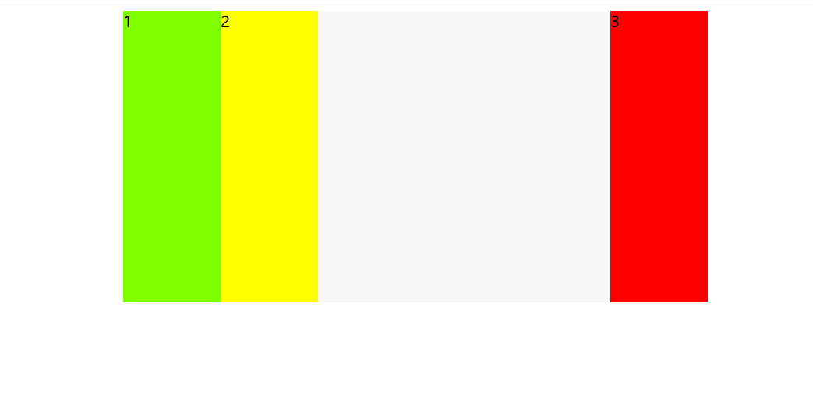

<h2 align="center">Flex 布局 实现 左二右一 </h2>



```html
<!DOCTYPE html>
<html lang="en">
  <head>
    <meta charset="UTF-8" />
    <meta http-equiv="X-UA-Compatible" content="IE=edge" />
    <meta name="viewport" content="width=device-width, initial-scale=1.0" />
    <title>Document</title>
  </head>
  <style>
    .box {
      width: 600px;
      height: 300px;
      background-color: #f8f8f8;
      margin: 0 auto;
      display: flex;
      flex-direction: row;
      justify-content: space-between;
    }

    .item {
      width: 100px;
    }

    .item.a {
      background: chartreuse;
    }

    .item.b {
      background: yellow;
    }

    .item.c {
      background: red;
      margin-left: auto;
    }
  </style>

  <body>
    <div class="box">
      <div class="item a">1</div>
      <div class="item b">2</div>
      <div class="item c">3</div>
    </div>
  </body>
</html>
```
