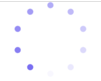

### CSS 实现 loading

- 圆环布局
  - position: absolute
  - transform: rotateZ(calc(0 \* 36deg)) translateY(-45px)
- 动画特效
  - steps()

#### 效果图



```html
<!DOCTYPE html>
<html lang="en">
  <head>
    <meta charset="UTF-8" />
    <meta http-equiv="X-UA-Compatible" content="IE=edge" />
    <meta name="viewport" content="width=device-width, initial-scale=1.0" />
    <title>Loading</title>
    <style>
      * {
        margin: 0;
        padding: 0;
      }

      li {
        list-style: none;
      }

      .box {
        display: flex;
        justify-content: center;
        align-items: center;
      }

      .loading {
        width: 100px;
        height: 100px;
        position: relative;
        display: flex;
        justify-content: center;
        align-items: center;
        border-radius: 50%;
        animation: rotate 1s steps(10) infinite;
      }

      .loading li {
        position: absolute;
        width: 8px;
        height: 8px;
        border-radius: 50%;
      }

      .loading li.li-1 {
        transform: rotateZ(calc(0 * 36deg)) translateY(-45px);
        background-color: rgba(115, 103, 240, 0.95);
      }

      .loading li.li-2 {
        transform: rotateZ(calc(1 * 36deg)) translateY(-45px);
        background-color: rgba(115, 103, 240, 0.85);
      }

      .loading li.li-3 {
        transform: rotateZ(calc(2 * 36deg)) translateY(-45px);
        background-color: rgba(115, 103, 240, 0.75);
      }

      .loading li.li-4 {
        transform: rotateZ(calc(3 * 36deg)) translateY(-45px);
        background-color: rgba(115, 103, 240, 0.65);
      }

      .loading li.li-5 {
        transform: rotateZ(calc(4 * 36deg)) translateY(-45px);
        background-color: rgba(115, 103, 240, 0.55);
      }

      .loading li.li-6 {
        transform: rotateZ(calc(5 * 36deg)) translateY(-45px);
        background-color: rgba(115, 103, 240, 0.45);
      }

      .loading li.li-7 {
        transform: rotateZ(calc(6 * 36deg)) translateY(-45px);
        background-color: rgba(115, 103, 240, 0.35);
      }

      .loading li.li-8 {
        transform: rotateZ(calc(7 * 36deg)) translateY(-45px);
        background-color: rgba(115, 103, 240, 0.25);
      }

      .loading li.li-9 {
        transform: rotateZ(calc(8 * 36deg)) translateY(-45px);
        background-color: rgba(115, 103, 240, 0.15);
      }

      .loading li.li-10 {
        transform: rotateZ(calc(9 * 36deg)) translateY(-45px);
        background-color: rgba(115, 103, 240, 0.05);
      }

      @keyframes rotate {
        0% {
          transform: rotate(0);
        }

        100% {
          transform: rotate(360deg);
        }
      }
    </style>
  </head>

  <body>
    <div class="box">
      <ul class="loading">
        <li class="li-1"></li>
        <li class="li-2"></li>
        <li class="li-3"></li>
        <li class="li-4"></li>
        <li class="li-5"></li>
        <li class="li-6"></li>
        <li class="li-7"></li>
        <li class="li-8"></li>
        <li class="li-9"></li>
        <li class="li-10"></li>
        <li class="li-11"></li>
        <li class="li-12"></li>
        <li class="li-13"></li>
        <li class="li-14"></li>
        <li class="li-15"></li>
        <li class="li-16"></li>
        <li class="li-17"></li>
        <li class="li-18"></li>
        <li class="li-19"></li>
        <li class="li-20"></li>
      </ul>
    </div>
  </body>
</html>
```
