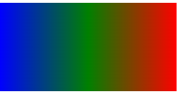
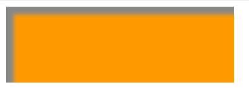

#### **1. css3 有哪些新特性**

| 特性       | 例子                                                                |
| :--------- | :------------------------------------------------------------------ |
| 新增选择器 | p:nth-child(n){ color: red }                                        |
| 弹性盒模型 | display: flex;                                                      |
| 多列布局   | column-count: 5;                                                    |
| 媒体查询   | @media (max-width: 480px) {.box: {column-count: 1;}}                |
| 个性化字体 | @font-face{font-family:BorderWeb;src:url(BORDERW0.eot);}            |
| 颜色透明度 | color: rgba(255, 0, 0, 0.75)                                        |
| 圆角       | border-radius: 5px;                                                 |
| 渐变       | background:linear-gradient(red, green, blue);                       |
| 阴影       | box-shadow:3px 3px 3px rgba(0, 64, 128, 0.3);                       |
| 倒影       | box-reflect: below 2px;                                             |
| 文字装饰   | text-stroke-color: red;                                             |
| 文字溢出   | text-overflow:ellipsis;                                             |
| 背景效果   | background-size: 100px 100px;                                       |
| 边框效果   | border-image:url(bt_blue.png) 0 10;                                 |
| 旋转       | transform: rotate(20deg);                                           |
| 倾斜       | transform: skew(150deg, -10deg);                                    |
| 位移       | transform:translate(20px, 20px);                                    |
| 缩放       | transform: scale(.5);                                               |
| 平滑过渡   | transition: all .3s ease-in .1s;                                    |
| 动画       | @keyframes anim-1 {50% {border-radius: 50%;}} animation: anim-1 1s; |

#### **2. :first-child 与 :first-of-type 的区别**

```html
<div>
  <p>第一个子元素</p>
  <h1>第二个子元素</h1>
  <span>第三个子元素</span>
  <span>第四个子元素</span>
</div>
```

**:first-child 选择器是 css2 中定义的选择器，从字面意思上来看也很好理解，就是第一个子元素**<br/>
**p:first-child** 匹配到的是 p 元素,因为 p 元素是 div 的第一个子元素；<br/>
**h1:first-child** 匹配不到任何元素，因为在这里 h1 是 div 的第二个子元素，而不是第一个；<br/>
**span:first-child** 匹配不到任何元素，因为在这里两个 span 元素都不是 div 的第一个子元素；

**:first-of-type 选择器是 css3 中定义的选择器，某父元素下相同类型子元素中的第一个**<br/>
**p:first-of-type** 匹配到的是 p 元素,因为 p 是 div 的所有类型为 p 的子元素中的第一个；<br/>
**h1:first-of-type** 匹配到的是 h1 元素，因为 h1 是 div 的所有类型为 h1 的子元素中的第一个；<br/>
**span:first-of-type** 匹配到的是第三个子元素 span。这里 div 有两个为 span 的子元素，匹配到的是它们中的第一个。

**结论：**
**:first-child** 匹配的是某父元素的第一个子元素，可以说是结构上的第一个子元素。
**:first-of-type** 匹配的是某父元素下相同类型子元素中的第一个，比如 **p:first-of-type**，就是指所有类型为 p 的子元素中的第一个。这里不再限制是第一个子元素了，只要是该类型元素的第一个就行了。
同样类型的选择器 **:last-chil**d 和 **:last-of-type、:nth-child(n)** 和 **:nth-of-type(n**) 也可以这样去理解。

#### **3. 解决使用 transform:translate 属性时会出现闪烁现象**

- 开启 GPU 硬件加速模式，使用 GPU 代替 CPU 渲染动画（在安卓系统中有时会有莫名其妙的 BUG，建议慎重）

```css
.tran {
  -webkit-transform: translateZ(0);
  -moz-transform: translateZ(0);
  -ms-transform: translateZ(0);
  -o-transform: translateZ(0);
  transform: translateZ(0); /* Other transform properties here */
}
```

- 隐藏转换的元素的背面

```css
.tran {
  -webkit-backface-visibility: hidden;
  -moz-backface-visibility: hidden;
  -ms-backface-visibility: hidden;
  backface-visibility: hidden;
  -webkit-perspective: 1000;
  -moz-perspective: 1000;
  -ms-perspective: 1000;
  perspective: 1000; /* Other transform properties here */
}
```

- 使被转换的元素的子元素保留其 3D 转换

```css
.tran {
  -webkit-transform-style: preserve-3d;
}
```

#### **4. 如何使用@keyframes 使 div 元素移动 200 像素**

```css
div {
  width: 100px;
  height: 50px;
  background: red;
  animation: move 3s;
}
@keyframes move {
  from {
    margin-left: 0px;
  }
  to {
    margin-left: 200px;
  }
}
```

#### **5. 如何实现文本换行**

:::tip
**word-wrap** 属性

- **normal**，只在允许的断字点换行（浏览器保持默认处理）
- **break-word**，在长单词或 URL 地址内部进行换行。

:::

#### **6. 超出文本省略（超出文本长度用 ... 代替）**

- **text-overflow: ellipsis;**

```css
div {
  display: -webkit-box;
  overflow: hidden;
  text-overflow: ellipsis;
  -webkit-line-clamp: 1;
  -webkit-box-orient: vertical;
}
```

#### **7. css3 动画如何在动作结束时保持状态不变**

:::tip

**animation-fill-mode**属性

- **none**，不改变默认行为。
- **forwards**，当动画完成后，保持最后一个属性值（在最后一个关键帧中定义）
- **backwards**，在 animation-delay 所指定的一段时间内，在动画显示之前，应用开始属性值（在第一个关键帧中定义）。
- **both**，向前和向后填充模式都可以应用。

:::

#### **8. 实现某 div 元素以每秒 50px 的速度左移 100px**

- **jQuery**

```js
$('div').animate({ 'left': 100}, 2000）;
```

- **Javascript + CSS**

```css
div {
  transition: all 2s linear;
}
```

```js
const div = document('element');
div.style.left =(div.offsetLeft + 100)+'px'；
```

#### **9. 介绍 box-sizing 属性**

- **content-box(默认值)** <br/>
  标准盒子模型。 width 与 height 只包括内容的宽和高， 不包括边框（border），内边距（padding），外边距（margin）。<br/>
  **注意**: 内边距、边框和外边距都在这个盒子的外部。 比如说，.box {width: 350px; border: 10px solid black;} 在浏览器中的渲染的实际宽度将是 370px。
  :::warning
  尺寸计算公式：<br/>
  width = 内容的宽度<br/>
  height = 内容的高度<br/>
  宽度和高度的计算值都不包含内容的边框（border）和内边距（padding）
  :::
- **border-box**
  width 和 height 属性包括内容，内边距和边框，但不包括外边距。这是当文档处于 Quirks 模式 时 Internet Explorer 使用的盒模型。<br/>
  **注意**: 填充和边框将在盒子内 , 例如, .box {width: 350px; border: 10px solid black;} 导致在浏览器中呈现的宽度为 350px 的盒子。内容框不能为负，并且被分配到 0，使得不可能使用 border-box 使元素消失。
  :::warning
  尺寸计算公式：<br/>
  width = border + padding + 内容的宽度<br/>
  height = border + padding + 内容的高度
  :::

#### **10. 如何实现把文本分隔为 4 列并使两列之间间隔 30 像素**

- **column-count** 多列布局
- **column-gap** 规定列之间的间隔

```css
div {
  width: 600px;
  -moz-column-count: 4;
  column-count: 4;
  -moz-column-gap: 40px;
  -webkit-column-gap: 40px;
  column-gap: 40px;
}
```

#### **11. background-clip 和 background-orgin 的区别**

- **background-clip** 设置元素的背景（背景图片或颜色）是否延伸到边框、内边距盒子、内容盒子下面。

```css
div {
  background-clip: padding-box | border-box | content-box;
}
```


- **background-origin** 规定 **background-position** 属性相对于什么位置来定位。

```css
div {
  background-origin: padding-box | border-box | content-box;
}
```


#### **12. css3 中 transition 属性值以及含义**

- **transition**
  - **transition-property**，哪个属性需要实现过渡
  - **transition-duration**，完成过渡效果需要多少秒/毫秒
  - **transition-timing-function**，速度效果的运动曲线，如 **linear | ease-in | ease | ease-out | ease-in-out | cube-bezier**。
  - **transition-delay**，规定过渡开始前的延迟时间。

#### **13. 当元素不面向屏幕时其可见性如何定义**

```css
div {
  backface-visibility: visible | hidden;
}
```

#### **14. 如何实现 css3 倒影**

- **-webkit-box-reflect** 设置方向、距离 **below | above | left | right**

```css
div {
  height: 144px;
  width: 144px;
  background: url(img url);
  -webkit-box-reflect: right 10px;
}
```


#### **15. css3 实现背景颜色线性渐变**

```css
div {
  width: 200px;
  height: 100px;
  background-image: linear-gradient(to left, red, green 50%, blue);
}
```



#### **16. 为盒子添加蒙版**

- 未成功 待定

#### **17. animation 属性值有哪些**

| 属性                      | 名称         | 必须 | 有效值                                                                         |
| :------------------------ | :----------- | :--: | :----------------------------------------------------------------------------- |
| animation-name            | 动画名称     |  √   | <b>custom-ident、string</b>                                                    |
| animation-duration        | 动画持续时间 |  √   | <b>time(s/ms)</b>                                                              |
| animation-timing-function | 动画运动形式 |  ×   | <b>常用 ease、ease-in、ease-out、ease-in-out、linear、step-start、step-end</b> |
| animation-delay           | 动画延迟时间 |  ×   | <b>time(s/ms)</b>                                                              |
| animation-iteration-count | 重复次数     |  ×   | <b>infinite、number(任意数值)</b>                                              |
| animation-direction       | 播放前重置   |  ×   | <b>normal、reverse、alternate、alternate-reverse</b>                           |
| animation-fill-mode       | 样式应用     |  ×   | <b>none、forwards、backwards、both</b>                                         |
| animation-play-state      | 播放状态     |  ×   | <b>running、paused</b>                                                         |

[\*animation-timing-function 更多用法](https://developer.mozilla.org/zh-CN/docs/Web/CSS/animation-timing-function)

##### **18. rem 的原理是什么**

::: tip
**rem** 方案的原理其实就是，将每一个不同的屏幕划分成相同的份数，让同一个元素在不同的屏幕上占据相同比例的空间。在做响应式布局的时候，通过调整 HTML 的字体大小，页面上所有使用 rem 单位的元素都会做相应的调整。
:::

#### **19. 如何设置 css3 文本阴影**

**text-shadow: h-shadow v-shadow blur color;**

```css
div {
  text-shadow: 9px 12px #ff0000;
}
```

#### **20. 如何把元素从左侧移动 50 像素，从顶端移动 100 像素**

```css
div {
  transform: translate(50px, 100px);
}
```

#### **21. 如何把一个元素旋转 30°**

```css
div {
  transform: rotate(30deg);
}
```

#### **22. 利用 css3 制作淡入淡出的动画效果**

```css
// 淡入
@keyframes fadeIn {
  from {
    opacity: 0;
  }

  to {
    opacity: 1;
  }
}
// 淡出
@keyframes fadeOut {
  from {
    opacity: 1;
  }

  to {
    opacity: 0;
  }
}

div {
  animation: fadeIn 2s ease-in-out;
}
```

#### **23. 在使用 Bootstrap 的同时使用地图 api，可能会造成 Bootstrap 与地图冲突，地图显示不出来，如何解决**

```css
.baidu-maps label {
  max-width: none;
}
```

#### **24. CSS3 新增伪类有哪些？**

| 属性              | 名称                                               |
| :---------------- | :------------------------------------------------- |
| p:first-of-type   | 选择属于其父元素的首个**p**元素的每个**p**元素     |
| p:last-of-type    | 选择属于其父元素的最后一个**p**元素的每个**p**元素 |
| p:only-of-type    | 选择属于其父元素的唯一**p**元素的每个**p**元素     |
| p:only-child      | 选择属于其父元素的唯一子元素的每个**p**元素        |
| p:nth-child（2）  | 选择属于其父元素的第二个子元素的每个**p**元素      |
| :enabled:disabled | 控制表单控件的禁用状态                             |
| :checked          | 单选框或复选框被选中                               |

#### **25. CSS3 动画的优点和缺点**

:::tip

**优点**

- 在性能上会稍微好一些，浏览器会对 CSS3 的动画做一些优化。
- 代码相对简单。

:::
:::tip

**缺点**

- 在动画控制上不够灵活 。
- 兼容性不好。
- 部分动画功能无法实现。

:::

#### **26. Animation 与 Transition 的异同是什么？**

Animation 与 Transition 的功能相同，都是通过改变元素的属性值来实现动画效果的。它们的区别在于，使用 Transition 的功能时只能用指定属性的开始值和结束值，然后在这两个属性值之间使用平滑过渡的方式实现动画效果，因此不能实现比较复杂的动画效果。

Animation 功能通过定义多个关键帧，以及定义每个关键帧中元素的属性值来实现更为复杂的动画效果。

#### **27. 媒体查询的使用方法**

**@media 媒体类型 and（媒体特性）{样式规则}**

```css
html {
  font-size: 20px;
}
@media （min-width：320px） {
  html {
    font-size: 12px;
  }
}
@media （min-width：360px） {
  html {
    font-size: 16px;
  }
}
```

但是这种做法有两个缺点。

（1）适配屏幕的尺寸不是连续的。

（2）会在 CSS 文件中添加大段的查询代码，增加了 CSS 文件的大小，为改进上述缺点，可以使用 JavaScript 获取移动设备屏幕的宽度，根据设计稿的原型尺寸，动态地计算 font-size 的值。

#### **28. 如何使用 matx0 将 di 元素旋转 30°**

```css
div {
  transform: matrix（0.866, 0.5, -0.5, 0.866, 0, 0）;
}
```

#### **29. 说一说盒阴影**

**box-shadow: h-shadow v-shadow blur spread color inset;**

```css
div {
  box-shadow: 10px 10px 5px #888888;
}
```


```css
div {
  box-shadow: 10px 10px 5px #888888 inset;
}
```



#### **29. link 和@import 有什么区别**

- link 是 XHTML 标签，除了加载 CSS 外，还可以定义 RSS 等其他事务；@import 属于 CSS 范畴，只能加载 CSS。
- link 引用 CSS 时，在页面载入时同时加载；@import 需要页面网页完全载入以后加载。所以会出现一开始没有 css 样式，闪烁一下出现样式后的页面(网速慢的情况下)
- link 是 XHTML 标签，无兼容问题；@import 是在 CSS2.1 提出的，低版本的浏览器不支持。
- link 支持使用 Javascript 控制 DOM 去改变样式；而@import 不支持。
  :::warning

  在 html 设计制作中，css 有四种引入方式。

  - 内联样式
  - 嵌入样式
  - 链接样式
  - 导入样式

  :::

#### **30. 清除浮动的方式有哪些及优缺点？**

- 额外标签法（在最后一个浮动标签后，新加一个标签，给其设置 clear：both；）（**不推荐**）
  :::danger

  如果我们清除了浮动，父元素自动检测子盒子最高的高度，然后与其同高。

  - **优点**：通俗易懂，方便
  - **缺点**：添加无意义标签，语义化差

        ```html
        <!DOCTYPE html>
        <html lang="en">
          <head>
            <meta charset="UTF-8" />
            <meta name="viewport" content="width=device-width, initial-scale=1.0" />
            <meta http-equiv="X-UA-Compatible" content="ie=edge" />
            <title>Document</title>
            <style>
              .fahter {
                width: 400px;
                border: 1px solid deeppink;
              }
              .big {
                width: 200px;
                height: 200px;
                background: darkorange;
                float: left;
              }
              .small {
                width: 120px;
                height: 120px;
                background: darkmagenta;
                float: left;
              }
              .footer {
                width: 900px;
                height: 100px;
                background: darkslateblue;
              }
              /* 额外的标签 */
              .clear {
                clear: both;
              }
            </style>
          </head>
          <body>
            <div class="fahter">
              <div class="big">big</div>
              <div class="small">small</div>
              <!-- 额外的标签 -->
              <div class="clear">额外标签法</div>
            </div>
            <div class="footer"></div>
          </body>
        </html>
        ```

    :::

- 父级添加 overflow 属性（父元素添加 overflow:hidden）（**不推荐**）

  :::danger

  通过触发 BFC 方式，实现清除浮动

  - **优点**：代码简洁

  - **缺点**：内容增多的时候容易造成不会自动换行导致内容被隐藏掉，无法显示要溢出的元素
    ```css
    .fahter {
      width: 400px;
      border: 1px solid deeppink;
      overflow: hidden;
    }
    ```

  :::

- 使用 after 伪元素清除浮动（推荐使用）
  :::tip

  - **优点**：符合闭合浮动思想，结构语义化正确
  - **缺点**：ie6-7 不支持伪元素：after，使用 zoom:1 触发 hasLayout.
    ```css
    .clearfix:after {
      /*伪元素是行内元素 正常浏览器清除浮动方法*/
      content: "";
      display: block;
      height: 0;
      clear: both;
      visibility: hidden;
    }
    .clearfix {
      *zoom: 1; /*ie6清除浮动的方式 *号只有IE6-IE7执行，其他浏览器不执行*/
    }
    ```
    ```html
    <body>
      <div class="fahter clearfix">
        <div class="big">big</div>
        <div class="small">small</div>
      </div>
      <div class="footer"></div>
    </body>
    ```

  :::

- 使用 before 和 after 双伪元素清除浮动
  :::tip

  - **优点**：代码更简洁
  - **缺点**：用 zoom:1 触发 hasLayout.

  ```css
  .clearfix:after,
  .clearfix:before {
    content: "";
    display: table;
  }
  .clearfix:after {
    clear: both;
  }
  .clearfix {
    *zoom: 1;
  }
  ```

  ```html
  <div class="fahter clearfix">
    <div class="big">big</div>
    <div class="small">small</div>
  </div>
  <div class="footer"></div>
  ```

  :::

#### **31. ::before 和:after 中单冒号和双冒号的区别是什么**

- 单冒号(:)用于 CSS3 伪类
- 双冒号(::)用于 CSS3 伪元素。（伪元素由双冒号和伪元素名称组成）

#### **32. css 的属性 content 有什么作用**

- content 属性与 :before 及 :after 伪元素配合使用，在元素头或尾部来插入生成内容。
  :::tip
  **说明**： 该属性用于定义元素之前或之后放置的生成内容。默认地，这往往是行内内容，不过该内容创建的盒子类型可以用属性 display 控制。
  :::

#### **33. 对 line-height 是如何理解**

- **line-height**【行高】顾名思意指一行文字的高度，用来指定行间的距离，具体来说是指两行文字间基线之间的最小距离。
  :::tip
  **line-height** 与 **font-size** 的计算值之差（在 CSS 中就是两行的“行间距”）分为两半，分别加到一个文本行内容的顶部和底部。可以包含这些内容的最小框就是行框。
     原始数字值指定了一个缩放因子，后代元素会继承这个缩放因子而不是计算值。即，当子元素节点设置 **line-heihgt:inherit;** 的时候，继承的是父元素节点的缩放因子。
  :::

#### **34. 对 z-index 的理解**

- z-index 属性是设置元素的堆叠顺序。拥有更高堆叠顺序的元素总是会处于堆叠顺序
  较低的元素的前面。
- 元素可拥有负的 z-index 属性值。
- Z-index 仅能在定位元素上奏效（例如 position:absolute;）。

#### **35. BFC 是什么**

[BFC 是什么](../css/bfc.md)

#### **36. Flex 布局**

[Flex 布局](../css//flex.md)

#### **37. 简述一下 Sass、Less，且说明区别？**

他们是动态的样式语言，是 CSS 预处理器,CSS 上的一种抽象层。他们是一种特殊的语法/语
言而编译成 CSS。

- 变量符不一样，less 是@，而 Sass 是$;
- Sass 支持条件语句，可以使用 **if{}else{},for{}**循环等等。而 Less 不支持;
- Sass 是基于 Ruby 的，是在服务端处理的，而 Less 是需要引入 **less.js** 输出到 Css 浏览器。
