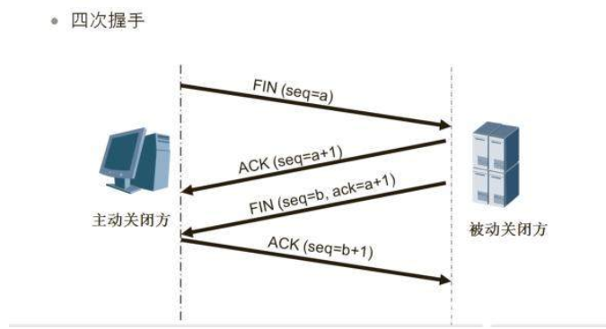

## Http 的 8 种请求类型

**OPTIONS**
返回服务器针对特定资源所支持的 HTTP 请求方法。也可以利用向 Web 服务器发送'\*'的请求来测试服务器的功能性。

**HEAD**
向服务器索要与 GET 请求相一致的响应，只不过响应体将不会被返回。这一方法可以在不必传输整个响应内容的情况下，
就可以获取包含在响应消息头中的元信息。

**GET**
向特定的资源发出请求。

**POST**
向指定资源提交数据进行处理请求（例如提交表单或者上传文件）。数据被包含在请求体中。POST 请求可能会导致新的
资源的创建和/或已有资源的修改。

**PUT**
向指定资源位置上传（更新）其最新内容。

**DELETE**
请求服务器删除 Request-URI 所标识的资源。

**TRACE**
回显服务器收到的请求，主要用于测试或诊断。

**CONNECT**
HTTP/1.1 协议中预留给能够将连接改为管道方式的代理服务器。

我们常用的有 GET （请求） POST （发送） PUT （更新） DELETE （删除），使用过程种遵守 HTTP 协议，可以让
我们的服务器更加精确的知道我们的操作和需求。

## Http 状态码

**_常见的状态码_**

```
# 200
  请求成功
# 301
  资源（网页等）被永久转移到其它URL
# 404
  请求的资源（网页等）不存在
# 500
  内部服务器错误
```

**_状态码分类_**

```
# 1**
  信息，服务器收到请求，需要请求者继续执行操作
# 2**
  成功，操作被成功接收并处理
# 3**
  重定向，需要进一步的操作以完成请求
# 4**
  客户端错误，请求包含语法错误或无法完成请求
# 5**
  服务器错误，服务器在处理请求的过程中发生了错误
```

**_状态码列表_**


## TCP 的三次握手 （链接）


**第一次握手：**
建立连接时，客户端发送 syn 包（syn=j）到服务器，并进入 SYN_SENT 状态，等待服务器确认；SYN：同步序列编号
（Synchronize Sequence Numbers）。

**第二次握手：**
服务器收到 syn 包，必须确认客户的 SYN（ack=j+1），同时自己也发送一个 SYN 包（seq=k），即 SYN+ACK 包，此时
服务器进入 SYN_RECV 状态；

**第三次握手：**
客户端收到服务器的 SYN+ACK 包，向服务器发送确认包 ACK(ack=k+1），此包发送完毕，客户端和服务器进入
ESTABLISHED（TCP 连接成功）状态，完成三次握手。

完成三次握手，客户端与服务器开始传送数据。

**_特殊情况_**

譬如发起请求遇到类似这样的情况：客户端发出去的第一个连接请求由于某些原因在网络节点中滞留了导致延迟，直到连接释放的
某个时间点才到达服务端，这是一个早已失效的报文，但是此时服务端仍然认为这是客户端的建立连接请求第一次握手，于是服务端
回应了客户端，第二次握手。

如果只有两次握手，那么到这里，连接就建立了，但是此时客户端并没有任何数据要发送，而服务端还在傻傻的等候佳音，造成很大
的资源浪费。所以需要第三次握手，只有客户端再次回应一下，就可以避免这种情况。

TCP 三次握手好比在一个夜高风黑的夜晚，你一个人在小区里散步，不远处看见小区里的一位漂亮妹子迎面而来，但是因为路灯有点暗
等原因不能 100%确认，所以要通过招手的方式来确定对方是否认识自己。

你首先向妹子招手(syn)，妹子看到你向自己招手后，向你点了点头挤出了一个微笑(ack)。你看到妹子微笑后确认了妹子成功辨认出了
自己(进入 estalished 状态)。

但是妹子有点不好意思，向四周看了一看，有没有可能你是在看别人呢，她也需要确认一下。妹子也向你招了招手(syn)，你看到妹子向
自己招手后知道对方是在寻求自己的确认，于是也点了点头挤出了微笑(ack)，妹子看到对方的微笑后确认了你就是在向自己打招呼(进入
established 状态)。

于是两人加快步伐，走到了一起，彼此之间相互拥抱。

我们来回顾一下，这个过程中总共有四个动作，

- 你招手
- 妹子点头微笑
- 妹子招手
- 你点头微笑

其中妹子连续进行了两个动作，先是点头微笑(回复对方)，然后再次招手(寻求确认)，实际上我们可以将这两个动作合成一个动作，招手
的同时点头和微笑(syn+ack)。于是这四个动作就简化成了三个动作。

- 你招手
- 妹子点头微笑并招手
- 你点头微笑

这就是三次握手的本质，中间的一次动作是两个动作的合并。

TCP 数据传输就是两个人隔空交流，有一定的距离，需要对方反复确认听见了自己的话。

你喊了一句话(data)，妹子听见了之后要向你回复自己听见了(ack)。如果你喊了一句，半天没听到妹子回复，你会很低落，好比谈恋爱
的时候，你满腔热情，而妹子忽冷忽热，所以你锲而不舍，一次不行，就两次，两次不行就三次，这就是 tcp 重传。

也有可能是妹子知道你的本意了，但是妹子有点害羞，迟迟没有回复亦或是妹子回复了你没收到，以至于你没收到妹子的回复。你不能判断
究竟到底妹子喜不喜欢你，对你有没有好感，没关系，男人嘛？要主动点，重传一下就好。

既然会重传，妹子就有可能同一句话听见了两次，这就是去重。对于重传和去重这两项工作操作系统的网络内核模块都已经帮我们处理好了，
我们不用理会。

## TCP 的四次挥手 （关闭）



**第一次挥手：**
客户端主动向服务器发送第一个报文（FIN1），告诉服务器数据已经传完了，可以关闭了。

**第二次挥手：**
服务器收到客户端的关闭报文（FIN1），并返回客户端一个 ACK，告诉客户端我这边已经收到你的请求。

**第三次挥手：**
服务器再次向客户端发送报文（FIN2），并告诉客户端我这边数据确实已经传完了，我要关闭了。

**第四次挥手:**
客户端收到服务器发送的报文（FIN2)，并返回服务器一个 ACK，你可以关闭了。

TCP 四次挥手 好比你和那个妹子拥抱以后，并且做了一些不可描述的事情，不知不觉时间很晚了，
你看了一下时间发现已经不早了，你是不是该回家了，妹子听到你说的话，然后看了一下时间发现一直和你腻歪，竟然忘记了时间了，
想到回去晚了可能会被老公骂，就恋恋不舍的给你说，那我回家了，你听到她说的以后点了点头，没有任何其他的挽留，她就又说我真
的要回家了，你很坚定地回了她一句你回去吧，她听完你说的话很生气的立马就走了，你还站在原地想着为什么会生气呢。过了一会实
在想不明白，你也赶紧回家哄老婆去了。

- 你给她说你该回家了
- 她确认时间，告诉你要回家了她
- 她就说她真的要回家
- 你回复她赶紧回家
