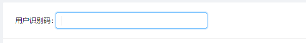

### 效果图



### 实现代码

```js
componentDidMount = () => {
  // 用 ref 自动获取输入框焦点
  const { input } = this.refInput;
  input.focus();
};

<Input
  ref={(input) => {
    this.refInput = input;
  }}
  style={{ width: 300 }}
/>;
```
